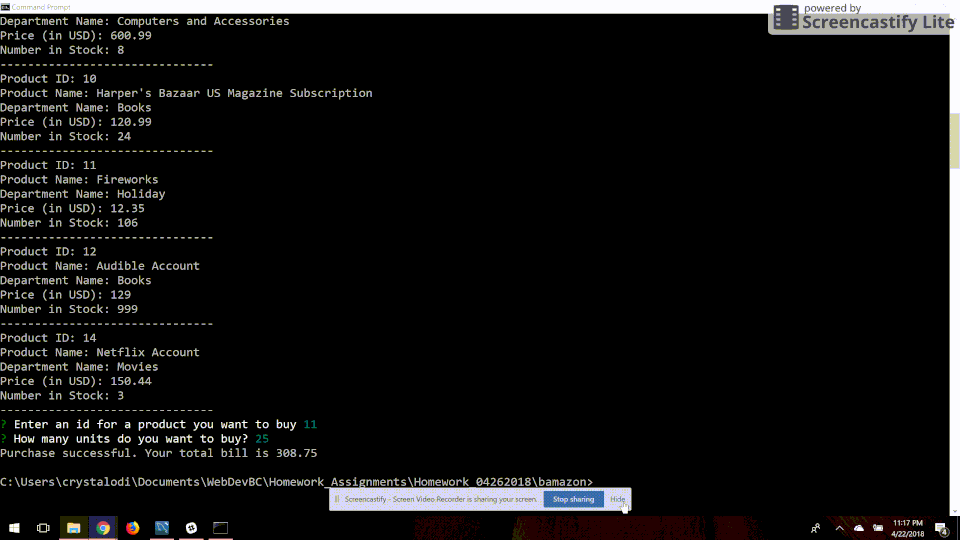

# Bamazon

Bamazon is a command line storefront based off of amazon. It allows a user logged in as a manager to add new products, add to inventory for an existing product, view low inventory, and view products for sale. It allows a user logged in as a customer to order any product from inventory.

## About The Application

## Getting Started

These instructions will get you a copy of the project up and running on your local machine.

### Prerequisites

Install the following programs if they aren't on your local machine.

Node (LTS) - http://nodejs.org

MySQL Workbench - https://dev.mysql.com/downloads/workbench/

GIT - https://git-scm.com/book/en/v2/Getting-Started-Installing-Git

### Installing

Clone [this](https://github.com/crystalodi/bamazon.git) repository to your computer

```
git clone
```

Run `bamazonschema.sql` within MySQL workbench. This will create a database called `bamazon`, which will contain a table called `products`. This table will consist of the following columns and 10 records representing products for sale will be inserted.
      
```sql
    CREATE TABLE products (item_id int auto_increment not null, product_name varchar(100) not null, department_name varchar(100) not null, price DECIMAL(10, 2) not null, stock_quantity int not null, PRIMARY KEY (item_id)
    );
```
         

In `bamazonCustomer.js` and `bamazonManager.js` change the `password` located in the connection object.
```javascript
  var mysql = require("mysql");
  var inquirer = require("inquirer");
  var connection = mysql.createConnection({
    host: "localhost",
    port: 3306,
    user: "root",
    database: "bamazon",
    password: "" //change this to whatever password you configured for your database MySQL workbench was installed
  }); 
```

Navigate to the file directory where you cloned the repository and run the command `npm install` from a terminal window

```
npm install
```

### File Structure

After following the steps in the Installation section, your folder should look like this:

```
  .gitignore
  bamazonCustomer.js
  bamazonManager.js
  bamazonschema.sql
  bamazon_customer_buy_product.gif
  bamazon_customer_insufficient.gif
  bamazon_manager_add_new_product.gif
  bamazon_manager_add_to_inventory.gif
  bamazon_manager_view_low_inventory.gif
  bamazon_manager_view_products_for_sale.gif
  package-lock.json
  package.json
  README.md
```

* `bamazonCustomer.js` Contains logic to display all products for sale from the `products` database followed by a prompt that will direct the user to enter a product id and quantity to buy when this file is done loading.
* `bamazonManager.js` Contains prompt which lets user to decide whether to view products for sale, view low product inventory, add to an existing products inventory, or add a new product. 
* `bamazonschema.sql` Contains sql to create database called bamazon with a table called product.


## How to Use

### Bamazon Customer view
Access the customer view of the app from a terminal window using the command `node bamazonCustomer.js`.

#### Buy a Product
After running `node bamazonCustomer.js`, there will be a list of all records currently in the `products` database table. Another prompt will display allowing a customer to enter an id for the product they want to buy and how much they want to buy of it. If there is enough `stock_quantity` to fulfill the order, the `stock_quantity` column in `products` will be updated to reflect that the order was successful.


#### Buy a product - Not enough quantity in stock
If there isn't enough `stock_quantity` the order will not be fulfilled and the user will get an "Insufficient quality message". The `stock_quantity` column in products will not be updated.


### Bamazon Manager view
Access the manager view of the app from a terminal window using the command `node bamazonManager.js`. A menu will display allowing the manager to select from the following options: View Products for Sale, View Low Inventory, Add to Inventory, and Add new Product.

#### View Products for Sale
This will display all records currently in the `products` formatted to show the Id of Item, Name of Product, Department of Product, Price of Product (USD), and Quantity in Stock.


#### View Low Inventory
This will display all records currently in the `products` formatted to show the Id of Item, Name of Product, Department of Product, Price of Product (USD), and Quantity in Stock for all products where the Quantity in Stock is less than 5.


#### Add to Inventory
This will update the quantity in stock for a certain product using a series of inquirer prompts to ask for the id of the item and the number that will be added to quantity in stock.


#### Add New Product
This will add a new record to the `products` table using a series of inquirer prompts to ask for the name of the product, department of product, quantity in stock, and price of product.


## Built With

* [NodeJS](https://nodejs.org/) - The web framework used
* [MySQL](https://www.npmjs.com/package/mysql) - Node Package used to query MySQL database
* [Inquirer](https://www.npmjs.com/package/inquirer) - Node packaged used to display prompts for customer view and manager view.

## Authors

* **Crystal Odi** - *Initial work* - [crystalodi](https://github.com/crystalodi)


## Acknowledgments

* MySQL Documentation


