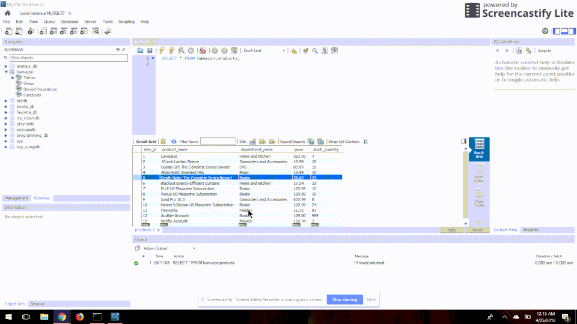

# Bamazon
## About
Bamazon is a command line storefront based off of amazon. This app utilizes the following Node Modules: mysql and inquirer. mysql is used to create, read, and update information in the `products` table in the `bamazon` database. inquirer is used to collect user input needed to perform database queries through the mysql node module.

## Install
* Install the LST (Latest Stable Release) version of NodeJS from [here](https://nodejs.org/en/download/).

* Clone [this](https://github.com/crystalodi/bamazon) repository to your computer

* Run `bamazonschema.sql`. This will create a database called `bamazon`, which will contain a table called `products`. This table will consist of the following columns and 10 records representing products for sale will be inserted.
      
      ```sql
         CREATE TABLE products (item_id int auto_increment not null, product_name varchar(100) not null, department_name varchar(100) not null, price DECIMAL(10, 2) not null, stock_quantity int not null, PRIMARY KEY (item_id)
         );```
         

* In `bamazonCustomer.js` and `bamazonManager.js` change the `password` located in the connection object.
     ```javascript
        var mysql = require("mysql");
        var inquirer = require("inquirer");
        var connection = mysql.createConnection({
          host: "localhost",
          port: 3306,
          user: "root",
          database: "bamazon",
          password: ""
        }); ```

* Navigate to the file directory where you cloned the repository and run the command `npm install` from a terminal window

## Bamazon Customer view
Access the customer view of the app from a terminal window using the command `node bamazonCustomer.js`.

### Buy a Product
After running `node bamazonCustomer.js`, there will be a list of all records currently in the `products` database table. Another prompt will display allowing a customer to enter an id for the product they want to buy and how much they want to buy of it. If there is enough `stock_quantity` to fulfill the order, the `stock_quantity` column in `products` will be updated to reflect that the order was successful.


### Buy a product - Not enough quantity in stock
If there isn't enough `stock_quantity` the order will not be fulfilled and the user will get an "Insufficient quality message". The `stock_quantity` column in products will not be updated.


## Bamazon Manager view
Access the manager view of the app from a terminal window using the command `node bamazonManager.js`. A menu will display allowing the manager to select from the following options: View Products for Sale, View Low Inventory, Add to Inventory, and Add new Product.

### View Products for Sale
This will display all records currently in the `products` formatted to show the Id of Item, Name of Product, Department of Product, Price of Product (USD), and Quantity in Stock.


### View Low Inventory
This will display all records currently in the `products` formatted to show the Id of Item, Name of Product, Department of Product, Price of Product (USD), and Quantity in Stock for all products where the Quantity in Stock is less than 5.


### Add to Inventory
This will update the quantity in stock for a certain product using a series of inquirer prompts to ask for the id of the item and the number that will be added to quantity in stock.


### Add New Product
This will add a new record to the `products` table using a series of inquirer prompts to ask for the name of the product, department of product, quantity in stock, and price of product.


